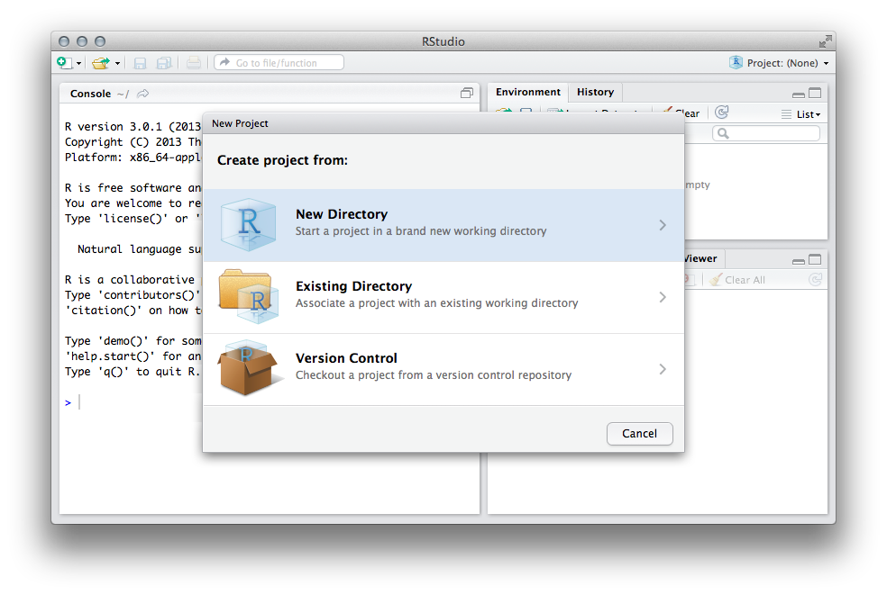
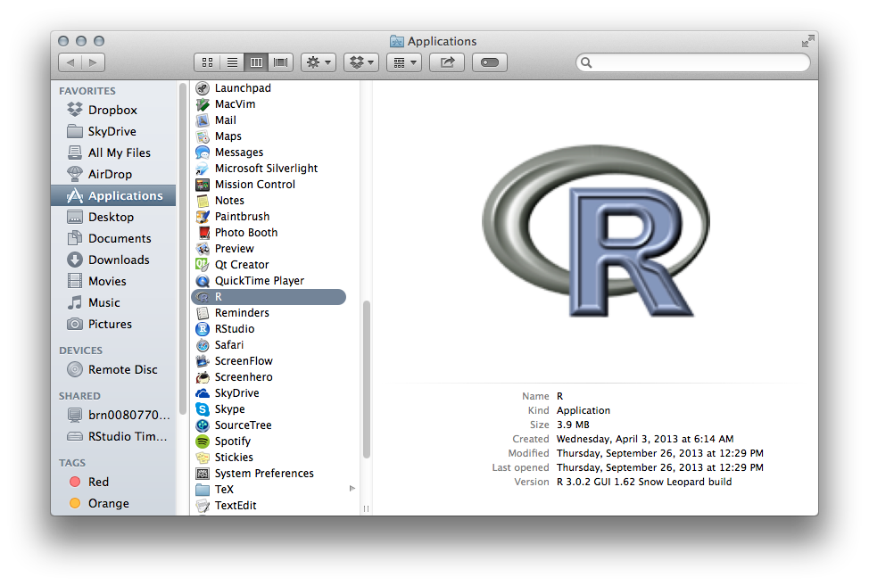
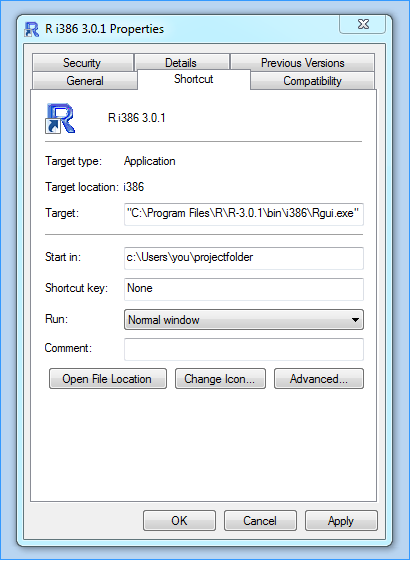
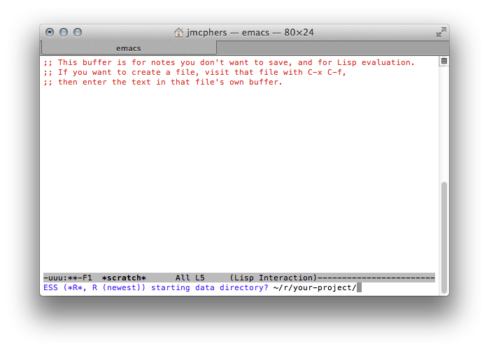

<iframe id="screencast" src="//player.vimeo.com/video/78556317" width="700" height="393" frameborder="0" webkitallowfullscreen="webkitallowfullscreen" mozallowfullscreen="mozallowfullscreen" allowfullscreen="allowfullscreen"> </iframe>

## Packrat is a dependency management system for R.

Use packrat to make your R projects more:

* **Isolated:** Installing a new or updated package for one project won't break your other projects, and vice versa. That's because packrat gives each project its own private package library.
* **Portable:** Easily transport your projects from one computer to another, even across different platforms. Packrat makes it easy to install the packages your project depends on.
* **Reproducible:** Packrat records the exact package versions you depend on, and ensures those exact versions are the ones that get installed wherever you go.

## Installing packrat

Until packrat is ready for CRAN, you can install it directly from GitHub using [devtools](https://github.com/hadley/devtools):

    install.packages("devtools")
    devtools::install_github("rstudio/packrat")

## Packrat by example

### 1. First things first

You're getting ready to start a new project, so you create a new directory that will eventually contain all the .R scripts, CSV data, and other files that are needed for this particular project.

You know you're going to need to make use of several R packages over the course of this project. So before you write your first line of code, set up the project directory to use packrat (an operation we call **bootstrap**):

```
> packrat::bootstrap("~/projects/babynames")
Adding these packages to packrat:
            _      
    packrat   0.1.0

Fetching sources for packrat (0.1.0) ... OK (Github)
Snapshot written to /home/jmcphers/projects/babynames/packrat.lock 
Installing packrat (0.1.0) ... OK (copied local binary)
Packrat startup directives installed. Please quit and restart your R session.
```

(Tip: If the current working directory is the project directory, you can omit the path.)

If `bootstrap` completes successfully, you'll see a message telling you to restart R. Do that, making sure that you're starting in the project directory ([see instructions](javascript:alert('TODO'))); in fact, you're going to need to start in the project directory every time from now on for packrat to work.

Now that you've restarted, you're no longer in an ordinary R project; you're in a packrat project. The main difference is that **a packrat project has its own private package library**. Any packages you install from inside a packrat project are only available to that project; and packages you install outside of the project are not available to the project. [except...]

This is what we mean by "isolation" and it's Very Good Thing, as it means that upgrading a package for one project won't break a totally different project that just happens to reside on the same machine, even if that package contained incompatible changes.

### 2. Adding, removing, and updating packages

Adding a package in a packrat project is easy. The first step is to start R inside your packrat project, and install the package however you normally do; usually that means either the `install.packages()` function or the "Install Packages" button in your favorite R IDE. Let's do this now, with the `reshape2` package.

```
> install.packages("reshape2")
```

If you completed the previous steps correctly, you just installed the `reshape2` package from CRAN into your project's private package library. Let's see if packrat notices the new package we installed.

```
> packrat::status()
The following packages are installed but not needed:
             _      
    plyr       1.8  
    reshape2   1.2.2
    stringr    0.6.2
Use packrat::clean() to remove them. Or, if they are actually needed
by your project, add `library(packagename)` calls to a .R file
somewhere in your project.
```

Not only does it detect `reshape2`, but the packages that `reshape2` itself depends on as well.

But notice these packages are "installed but not needed". That's because packrat only considers packages that appear in `library()` or `require()` calls in your *.R script files to be used by the project. Let's satisfy packrat by creating a `babynames.R` file, and put this single line in it:

```
library(reshape2)
```

Now let's check the status again.

```
> packrat::status()

The following packages have been updated in your library, but have not
been recorded in packrat:
               library   packrat
    plyr           1.8        NA
    reshape2     1.2.2        NA
    stringr      0.6.2        NA
Use packrat::snapshot() to record these packages in packrat.
```

That's better. Let's do what it says and call `snapshot()`.

```
> packrat::snapshot()

Adding these packages to packrat:
             _        
    lattice    0.20-24
    plyr       1.8    
    reshape2   1.2.2  
    stringr    0.6.2  

Fetching sources for lattice (0.20-24) ... OK (CRAN current)
Fetching sources for plyr (1.8) ... OK (CRAN current)
Fetching sources for stringr (0.6.2) ... OK (CRAN current)
Fetching sources for reshape2 (1.2.2) ... OK (CRAN current)
Snapshot written to /home/jmcphers/projects/babynames/packrat.lock 
Installing lattice... OK (built source)
```

When packrat takes a snapshot, it looks in the project's private package library for packages that have been added, modified, or removed since the last time `snapshot` was called. For packages that were added or modified, packrat attempts to go find the uncompiled _source package_ from CRAN, Bioconductor, or GitHub (caveat: only for packages that were installed using `devtools` version 1.4 or later), and save them in the `packrat.sources` project subdirectory. It also records metadata about each package in a `packrat.lock` file.

Because we save source packages for all of your dependencies, packrat makes your project more **reproducible**. When someone else wants to run your project--even if that someone else is you, years in the future, dusting off some old backups--they won't need to try to figure out what versions of what packages you were running, and where you got them.

### 3. Restoring snapshots

Once your project has a snapshot, you can easily install the packages from that snapshot into your private library at any time.

You'll need to do this, for example, when copying the project to a new computer, especially to one with a different operating system. Let's simulate this by exiting R and then deleting the `library` subdirectory in your project. Then launch R from your project directory again.

As R starts, you should be greeted with a message like this:

```
Creating private package library at
/home/jmcphers/projects/babynames/library/x86_64-pc-linux-gnu/3.0.2
Packrat needs to install the packages this project depends on. Run
initPackrat() to get started.
```

Go ahead and run `initPackrat()` as it directs. `initPackrat` is responsible for installing the packrat package itself into the private package library, and then calling `packrat::restore()` to install the rest of the snapshotted packages.

```
> initPackrat()
Initializing packrat... OK
Installing lattice (0.20-24) ... OK (built source)
Installing plyr (1.8) ... OK (built source)
Installing stringr (0.6.2) ... OK (built source)
Installing reshape2 (1.2.2) ... OK (built source)
```

All of the packages in the snapshot have now been installed in your project's newly created private package library.

```
> packrat::status()
Up to date.
```

Another reason to restore from the packrat snapshot is if you remove a package that you later realize you still needed, or if one of your collaborators makes their own changes to the snapshot. In these cases, you can call `packrat::restore()` (as `initPackrat()` is only designed for cases where even packrat itself is not installed).

Let's remove the plyr package, and use `packrat::restore()` to bring it back.

```
> remove.packages("plyr")
Removing package from
‘/home/jmcphers/projects/babynames/library/x86_64-pc-linux-gnu/3.0.2’
(as ‘lib’ is unspecified)
Changes made to this project's private library may need to be snapshotted.
Run packrat::status() to see differences since the last snapshot.

> packrat::status()

The following packages are missing from your library, or are out of date:
           packrat   library
    plyr       1.8        NA
Use packrat::restore() to install/remove the appropriate packages.

> packrat::restore()
Installing plyr (1.8) ... OK (built source)
```

### Collaboration (Git, SVN)

Packrat is designed to work with your favorite source control system. When you use Packrat with source control, you can be sure you and your collaborators are all working with the same set of packages at the same versions. For this example we'll use Git, but the same principles apply to other source control systems.

When you add a Packrat project directory to source control, you'll add its support files too. These store the packages and snapshots needed to recreate the private package library. If your project is already under source control, you just need to add the new support files:


```
$ git add packrat.lock
$ git add packrat.sources/
$ git add .Rprofile
$ git add .Renviron
$ git commit -m "Add Packrat"
```

You can also commit the library itself, but it isn't necessary; as you saw above, Packrat can recreate the library. 

Whenever you run `packrat::snapshot()`, Packrat will make changes to the `packrat.lock` file and sources in the `packrat.sources/` directory. You'll want to include these changes with your commit. The snapshot that you take can then be applied by your collaborators so that their private libraries match yours.

Let's say you've just added another dependency to your project. As before, you run `packrat::snapshot()` to store this change:

```
> packrat::snapshot()

Adding these packages to packrat:
             _        
    chartreuse    1.07

Fetching sources for chartreuse (1.07) ... OK (CRAN current)
Snapshot written to /home/jmcphers/projects/babynames/packrat.lock 
```

Next, you check Git to see what's changed:

```
$ git status
# On branch master
# Changes not staged for commit:
#   (use "git add <file>..." to update what will be committed)
#   (use "git checkout -- <file>..." to discard changes in working directory)
#
#   modified:   packrat.lock
#   modified:   packrat.sources/chartreuse/chartreuse-1.07.tar.gz
#   modified:   colors.R
```

Packrat's snapshot includes changes to the lockfile, and sources for the new dependency. You commit these changes with your code. 

```
$ git add colors.R
$ git add packrat.sources/
$ git add packrat.lock
$ git commit -m "Add support for chartreuse" 
$ git push
...
To https://github.com/jmcphers/babynames
   d28a993..e0be144  master -> master
````

Later, your collaborator picks up your changes, and notices that you've made some changes in Packrat.

```
$ git pull
Updating d28a993..e0be144
Fast-forward
 colors.R | 3 ++-
 packrat.lock | 5 ++++++
 packrat.sources/chartreuse/chartreuse-1.07.tar.gz 
 3 files changed, 7 insertions(+), 1 deletion(-)
```

Your collaborator applies your snapshot with `restore()`: 

```
> packrat::restore()
Installing chartreuse (1.07) ... OK (built source)
```

Now you're both working with the `chartreuse` package.

Of course, in addition to adding new dependencies, Packrat's controlled environment can help your team safely update and remove dependencies together without compromising your results.

### Conflict resolution

### Caveats

#### Package types

Packrat can only work with three types of packages: 

1. Packages installed from a CRAN repository (or a CRAN-like repository such as Bioconductor)
2. Packages installed by `devtools::install_github`, version 1.4 or later.
3. Local source packages (via the `sourcePackagePaths` parameter)

If you depend on a package that doesn't fall into any of these types, you'll need to coerce it into one of these types. The easiest way to do this is to put the package's source into a `.tar.gz` file, and use the `sourcePackagePaths` parameter. Note that if you use this mechanism, you will need to update the version of the package every time you make a change to the source code; Packrat relies on version numbers for local source packages to know when they've been updated.

#### Building packages

Packrat prefers to install binary versions of packages from CRAN-like repositories when available. However, many packages don't have binaries, and even those that do now may not have them in the near future (CRAN does not archive binaries, only sources). 

Packrat stores the sources for each package locally, so that your project never depends on having platform binaries available from a mirror.

However, this means it is almost certain that you'll need to be able to build source packages locally in order to use Packrat. See [Package Development Prerequisites](http://www.rstudio.com/ide/docs/packages/prerequisites) to learn more about the tools to install for your operating system. It's recommended that you and your collaborators prepare your machines for package development before using Packrat.

## Basic concepts

If you're like the vast majority of R users, when you start working on a new R project you create a new directory for all of your R scripts and data files.

Packrat enhances your project directory by storing your package dependencies inside it, rather than relying on your personal R library that is shared across all of your other R sessions. We call this directory your **private package library** (or just **private library**). When you start an R session in a packrat project directory, R will only look for packages in your private library; and anytime you install or remove a package, those changes will be made to your private library.

Unfortunately, private libraries don't travel well; like all R libraries, their contents are compiled for your specific machine architecture, operating system, and R version. Packrat lets you **snapshot** the state of your private library, which saves to your project directory whatever information packrat needs to be able to recreate that same private library on another machine. The process of installing packages to a private library from a snapshot is called **restoring**.

## R Projects and Directories

In Packrat, a project is just a directory of files. In order to work with the directory as a Packrat project, you need to start an R session **in the project directory**, so that R and Packrat know which project you're working with during the session. Here's how to start an R session in a particular directory using a few common IDEs:

### RStudio

In the upper right corner of the IDE, click the project picker and choose New Project. RStudio will allow you to create a new directory or use an existing one. 



Once you have created a project, opening the project will automatically start a new R session in the project's directory. 

### R GUI (Mac)



Open your Applications folder in Finder, and open a second Finder window in the directory that contains the folder for your project. Drag your project's folder icon onto the R icon. A new R GUI session will start in the chosen directory.

### R GUI (Windows)



Right-click on the shortcut you use to open R GUI, and choose Properties. Change the "Start in:" value to the directory for your project, then restart R GUI.

### ESS



By default, ESS will prompt you for the working directory to use when starting the R process. Simply enter the path to your project's directory.

ESS can be configured to choose a directory automatically (for instance, it may use the working directory of the current buffer); if you don't get a directory prompt, see [Customizing Startup](http://ess.r-project.org/Manual/ess.html#Customizing-startup) in the ESS manual for more information. 

### Other IDEs

Packrat should work with any other IDE--just be sure that the current working directory when the R session starts is your project's directory.

## Commands

Use `bootstrap()` to create a new packrat project, `snapshot()` to record changes to your project's library, and `restore()` to recreate your library the way it was the last time you (or anyone!) took a snapshot. 

Using these simple functions and sharing packrat's files lets you collaborate in a shared, consistent environment with others as your project grows and changes, and provides an easy way to share your results when you're done.

    bootstrap(projDir = ".")

Initializes a regular R project directory as a packrat project. This creates the supporting files and directories listed below in "Anatomy of a packrat project", including a private library and snapshot. **You must restart your R session after running `bootstrap()` in order to use packrat.**

    status(projDir = '.')

Shows the differences between the project's packrat snapshot, its private package library, and its R scripts.

These differences are created when you use the normal R package management commands like `install.packages()`, `update.packages()`, and `remove.packages()`. To bring these differences into packrat, you can use `snapshot()`.

Differences can also arise if one of your collaborators adds or removes packages from the packrat snapshot. In this case, you simply need to tell packrat to update your private package library using `restore()`.

    snapshot(projDir = ".")

Stores the state of the private library (each package and its exact version) in packrat. 

You'll need to call this after making changes to the private library as described above. Snapshotting your library makes it possible to restore to the snapshot later, and if you're sharing a project with someone else using a version control system, packrat can use the snapshot to mirror your library changes on your collaborator's library. 

    restore(projDir = ".")

Adds, removes, and changes packages installed in the private library so that they match the state of the most recent snapshot.

You'll need to call this after copying a project onto a new machine, or if you're using version control (see section below) and someone else added a package that you don't have installed yet.

    clean(projDir = ".")

Removes any packages in the private library that aren't being referenced from .R files in the project.

## Anatomy of a packrat project

A packrat project contains a few extra files and directories. The `bootstrap()` function creates these files for you, if they don't already exist.

* `library/`: Private package library for this project.
* `packrat.lock`: Lists the precise package versions that were used to satisfy dependencies, including dependencies of dependencies. (This file should never be edited by hand!)
* `packrat.sources/`: Source packages of all the dependencies that packrat has been made aware of.
* `.Rprofile` and `.Renviron`: Directs R to use the private package library (when it is started from the project directory).

## Using packrat with version control

Packrat is designed to work hand in hand with Git, Subversion, or any other version control system. Be sure to check in the `.Rprofile`, `.Renviron`, and `packrat.lock` files, as well as everything under `packrat.sources/`. You can tell your VCS to ignore `library` (or feel free to check it in if you don't mind taking up some extra space in your repository).
